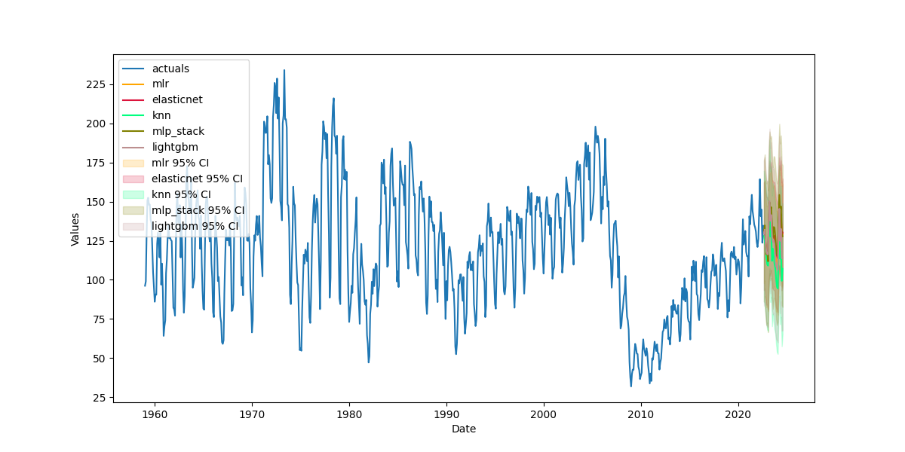

# Scalecast

<p align="center">
  
</p>

## About

Scalecast is a light-weight time-series forecasting procedure, wrapper, and results container built by and for applied Data Scientists using an ML framework. It offers a streamlined transforming, tuning, reverting, and reporting interface with many model classes, from basic ARIMA and linear models to boosted trees and recurrent neural nets. No matter which models you want to play with, the uniform interface makes it easy and fun to get results quickly.  

## Official Docs
- [Read the Docs](https://scalecast.readthedocs.io/en/latest/)  
- [Introductory Notebook](https://scalecast-examples.readthedocs.io/en/latest/misc/introduction/Introduction2.html)  
- [Change Log](https://scalecast.readthedocs.io/en/latest/change_log.html)  
 
## Example Starter Code

```python
from scalecast.Forecaster import Forecaster
from scalecast.Pipeline import Pipeline, Transformer, Reverter
from scalecast.auxmodels import mlp_stack
from scalecast import GridGenerator
import matplotlib.pyplot as plt
import pandas_datareader as pdr

# add more/fewer models to the below tuple
models = (
  'mlr',
  'elasticnet',
  'lightgbm',
  'knn',
) # https://scalecast.readthedocs.io/en/latest/Forecaster/_forecast.html
# grids for tuning models (see the Grids.py file)
GridGenerator.get_example_grids()
# extract data (this is an example dataset)
df = pdr.get_data_fred(
  'HOUSTNSA',
  start='1959-01-01',
  end='2022-08-01'
)
# build the forecaster object
f = Forecaster(
  y=df['HOUSTNSA'],
  current_dates=df.index,
  future_dates=24,
  test_length=48, # not required to set a test length but testing models is necessary for generating confidence intervals
  cis = True, # all models called will have confidence intervals if this is True (default is False)
)
# this function will be placed in a pipeline
def forecaster(f,models):
    f.add_covid19_regressor()
    f.auto_Xvar_select()
    f.tune_test_forecast(
        models,
        dynamic_testing=24, # test-set metrics will be an average of rolling 24-step forecasts
        cross_validate=True, # models tuned with cross-validation, excludes test set
        k = 3, # 3-fold (time series) cross validation
    )
    mlp_stack(f,models) # a stacking model offered by scalecast
# transform data to make it stationary/easier to predict        
transformer = Transformer(
    transformers = [
        ('DiffTransform',1),
        ('DiffTransform',12),
    ],
)
reverter = Reverter(
    # list reverters in reverse order
    reverters = [
        ('DiffRevert',12),
        ('DiffRevert',1),
    ],
    base_transformer = transformer,
)
pipeline = Pipeline(
    steps = [
        ('Transform',transformer),
        ('Forecast',forecaster),
        ('Revert',reverter),
    ],
)
f = pipeline.fit_predict(f,models=models)
f.plot(
  ci=True, # setting this to True will not throw an error if there are no confidence intervals
  order_by='TestSetMAPE',
)
plt.legend(loc = 'upper left')
plt.show()
# export results
results = f.export(
  [
    'model_summaries', # info about hyperparams, xvars, scaling, erros, etc.
    'all_fcsts', # point forecasts
  ],
  cis = True, # confidence intervals placed on point forecasts
)
```


## Installation
- Only the base package is needed to get started:  
  - `pip install --upgrade scalecast`  
- Optional add-ons:  
  - `pip install tensorflow` (for RNN/LSTM on Windows) or `pip install tensorflow-macos` (for MAC/M1)
  - `pip install darts`  
  - `pip install prophet`  
  - `pip install greykite` (for the silverkite model)  
  - `pip install shap` (SHAP feature importance)  
  - `pip install kats` (changepoint detection)  
  - `pip install pmdarima` (auto arima)  
  - `pip install tqdm` (progress bar for notebook)  
  - `pip install ipython` (widgets for notebook)  
  - `pip install ipywidgets` (widgets for notebook)  
  - `jupyter nbextension enable --py widgetsnbextension` (widgets for notebook)  
  - `jupyter labextension install @jupyter-widgets/jupyterlab-manager` (widgets for Lab)  

## Features and Articles

### [Forecasting with Different Model Types](https://scalecast.readthedocs.io/en/latest/Forecaster/_forecast.html)
- Sklearn Univariate
  - [Expand your Time Series Arsenal with These Models](https://towardsdatascience.com/expand-your-time-series-arsenal-with-these-models-10c807d37558)
  - [Notebook](https://scalecast-examples.readthedocs.io/en/latest/sklearn/sklearn.html)
- Sklearn Multivariate
  - [Multiple Series? Forecast Them together with any Sklearn Model](https://towardsdatascience.com/multiple-series-forecast-them-together-with-any-sklearn-model-96319d46269)
  - [Notebook](https://scalecast-examples.readthedocs.io/en/latest/multivariate/multivariate.html)
- RNN 
  - [Exploring the LSTM Neural Network Model for Time Series](https://towardsdatascience.com/exploring-the-lstm-neural-network-model-for-time-series-8b7685aa8cf)
  - [LSTM Notebook](https://scalecast-examples.readthedocs.io/en/latest/lstm/lstm.html)
  - [RNN Notebook](https://scalecast-examples.readthedocs.io/en/latest/rnn/rnn.html)
- ARIMA
  - [Forecast with ARIMA in Python More Easily with Scalecast](https://towardsdatascience.com/forecast-with-arima-in-python-more-easily-with-scalecast-35125fc7dc2e)
  - [Notebook](https://scalecast-examples.readthedocs.io/en/latest/arima/arima.html)
- Theta
  - [Easily Employ A Theta Model For Time Series](https://medium.com/towards-data-science/easily-employ-a-theta-model-for-time-series-b94465099a00)
  - [Notebook](https://scalecast-examples.readthedocs.io/en/latest/theta/theta.html)
- VECM
  - [Employ a VECM to predict FANG Stocks with an ML Framework](https://medium.com/p/52f170ec68e6)
  - [Notebook](https://scalecast-examples.readthedocs.io/en/latest/vecm/vecm.html)
- Other Notebooks
  - [Prophet](https://scalecast-examples.readthedocs.io/en/latest/prophet/prophet.html)
  - [Combo](https://scalecast-examples.readthedocs.io/en/latest/combo/combo.html)
  - [Holt-Winters Exponential Smoothing](https://scalecast-examples.readthedocs.io/en/latest/hwes/hwes.html)
  - [Silverkite](https://scalecast-examples.readthedocs.io/en/latest/silverkite/silverkite.html)

### [Transforming and Reverting](https://scalecast.readthedocs.io/en/latest/Forecaster/SeriesTransformer.html)
- [Time Series Transformations (and Reverting) Made Easy](https://medium.com/towards-data-science/time-series-transformations-and-reverting-made-easy-f4f768c18f63)
- [Notebook 1](https://scalecast-examples.readthedocs.io/en/latest/transforming/series_transformer.html)
- [Notebook 2](https://github.com/mikekeith52/scalecast-examples/blob/main/transforming/medium_code.ipynb)
  
### Confidence Intervals
- [Easy Distribution-Free Conformal Intervals for Time Series](https://medium.com/towards-data-science/easy-distribution-free-conformal-intervals-for-time-series-665137e4d907)
- [Notebook](https://scalecast-examples.readthedocs.io/en/latest/misc/cis/cis.html)  

### Dynamic Validation
- [How Not to be Fooled by Time Series Models](https://towardsdatascience.com/how-not-to-be-fooled-by-time-series-forecasting-8044f5838de3)
- [Model Validation Techniques for Time Series](https://towardsdatascience.com/model-validation-techniques-for-time-series-3518269bd5b3)
- [Notebook](https://scalecast-examples.readthedocs.io/en/latest/misc/validation/validation.html)

### Model Input Selection
- [Variable Reduction Techniques for Time Series](https://medium.com/towards-data-science/variable-reduction-techniques-for-time-series-646743f726d4)
- [Auto Model Specification with ML Techniques for Time Series](https://mikekeith52.medium.com/auto-model-specification-with-ml-techniques-for-time-series-e7b9a90ae9d7)
- [Notebook 1](https://scalecast-examples.readthedocs.io/en/latest/misc/feature-selection/feature_selection.html)
- [Notebook 2](https://scalecast-examples.readthedocs.io/en/latest/misc/auto_Xvar/auto_Xvar.html)

### Scaled Forecasting on Many Series
- [May the Forecasts Be with You](https://towardsdatascience.com/may-the-forecasts-be-with-you-introducing-scalecast-pt-2-692f3f7f0be5)
- [Introductory Notebook Section](https://scalecast-examples.readthedocs.io/en/latest/misc/introduction/Introduction2.html#Scaled-Automated-Forecasting)

### Anomaly Detection
- [Anomaly Detection for Time Series with Monte Carlo Simulations](https://towardsdatascience.com/anomaly-detection-for-time-series-with-monte-carlo-simulations-e43c77ba53c?source=email-85177a9cbd35-1658325190052-activity.collection_post_approved)
- [Notebook1](https://scalecast-examples.readthedocs.io/en/latest/misc/anomalies/anomalies.html)
- [Notebook2](https://github.com/mikekeith52/scalecast-examples/blob/main/misc/anomalies/monte%20carlo/monte%20carlo.ipynb)

## Contributing
- [Contributing.md](https://github.com/mikekeith52/scalecast/blob/main/Contributing.md)
- Want something that's not listed? Open an [issue](https://github.com/mikekeith52/scalecast/issues/new)!  